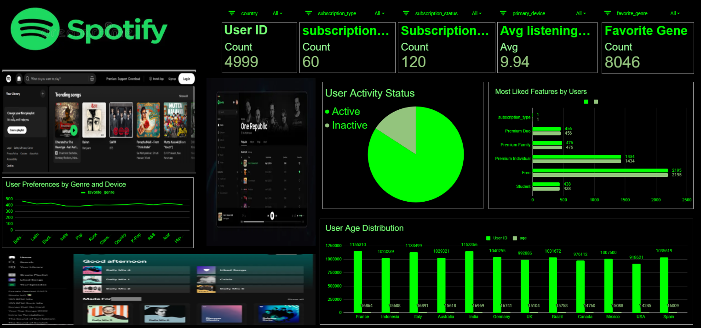

# 🎧 Spotify User Behavior Dashboard Analysis

##  Project Overview

This project showcases an interactive **Spotify User Behavior Dashboard** created using **Google Sheets**, focusing on analyzing how users interact with a music streaming platform.

The dataset represents simulated user activity and is structured to explore patterns in:

* Listening habits
* Subscription choices
* User engagement levels
* Music preferences

The goal of this project is to transform raw data into meaningful insights through visualization and analysis.

---

##  Dashboard Preview

  

---

##  Dataset Information

* **File Name:** spotify_user_data.xlsx
* **Total Records:** Up to 5000 entries
* **Unique Identifier:** user_id

---

##  Data Description

| Column Name         | Description                        | Data Type   |
| ------------------- | ---------------------------------- | ----------- |
| user_id             | Unique user identifier             | Integer     |
| age                 | User age                           | Integer     |
| subscription_type   | Type of plan (Free / Premium)      | Categorical |
| subscription_status | Current status (Active / Inactive) | Categorical |
| signup_date         | Registration date                  | Date        |
| avg_listening_hours | Daily average listening time       | Float       |
| favorite_genre      | Preferred music category           | Categorical |

---

##  Key Observations

*  Users with premium subscriptions tend to have higher listening time
*  A majority of users remain active on the platform
*  Genres such as Pop, Bollywood, and Latin dominate user preferences
*  Listening patterns differ significantly across age groups

---

##  Analytical Focus Areas

###  Engagement Analysis

Evaluate differences in activity between Free and Premium users

###  Growth Trends

Track user acquisition using signup dates

###  Behavioral Patterns

Analyze how age influences listening time and preferences

###  Genre Insights

Identify trending and most popular genres

---

##  Data Preparation

* Cleaned missing and inconsistent values
* Standardized date formats
* Reduced dataset size for efficient analysis
* Built pivot tables for summarization

---

##   Dashboard Highlights

*  Key Performance Indicators (KPIs)

  * Total Users
  * Active Users
  * Average Listening Time

*  Subscription Breakdown

*  Genre Popularity Visualization

*  Listening Time Analysis

*  Interactive Slicers for dynamic filtering

---

##  Tools & Technologies

* Google Sheets
* Pivot Tables
* Data Visualization Techniques

---

##  How to Explore

1. Open the dataset in Excel or Google Sheets
2. Review pivot tables and charts
3. Use slicers to filter and interact with data
4. Analyze trends and derive insights

---

##  Summary

This project demonstrates how structured data can be used to uncover insights into **user behavior, engagement trends, and music preferences**. It serves as a practical example for data analysis, visualization, and dashboard creation.

---

