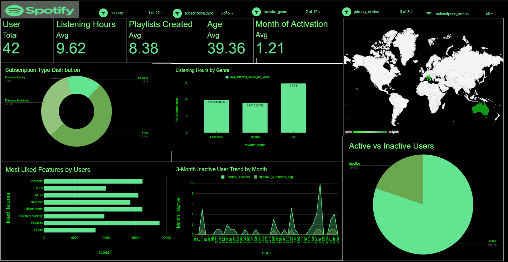

# 🎧 Spotify User Analytics Dataset

## 📊 Project Overview
This dataset captures user activity and engagement on Spotify. It is designed to support user behavior analysis, subscription insights, and engagement tracking.

The dataset powers an interactive dashboard built using Google Sheets, helping visualize listening habits, feature usage, and churn patterns.

##  File Details

- **Filename:** `spotify_user_analytics.csv`  
- **Total Records:** 5000  
- **Primary Key:** `user_id`  

---

##  Data Dictionary

| Column Name | Description | Data Type |
|------------|------------|----------|
| user_id | Unique identifier for each user | String |
| country | User location | Categorical |
| age | User age | Integer |
| subscription_type | Free, Premium Individual, Student, Family | Categorical |
| listening_hours_per_week | Avg weekly listening hours | Float |
| playlists_created | Number of playlists created | Integer |
| favorite_genre | Preferred genre (Electronic, Hip-Hop, R&B) | Categorical |
| primary_device | Device used (Mobile, Desktop, Tablet) | Categorical |
| subscription_status | Active / Inactive | Categorical |
| liked_feature | Most liked feature | Categorical |
| months_inactive | Number of inactive months | Integer |
| inactive_3_months_flag | Indicates churn risk | Boolean |
| activation_month | Month of activation | Integer |

---

##  Key Insights & Statistics

-  **Total Users:** 5000  
-  **Avg Listening Hours:** 9.62 hrs/week  
-  **Avg Playlists Created:** 8.38  
-  **Avg Age:** 39.36  
-  **Avg Activation Month:** 1.21  

###  Subscription Distribution
- Free: ~51%  
- Premium Individual: ~32%  
- Student: ~11%  
- Family: ~5%  

###  Listening Behavior
- R&B users have the highest engagement (~14.8 hrs/week)  
- Electronic and Hip-Hop show moderate usage  

###  Feature Popularity
- Most liked: Playlists  
- Followed by: Podcasts, Offline Mode, AI DJ  

###  User Engagement
- Active Users: ~80%  
- Inactive Users: ~20%  

---

##  Analysis Suggestions

- **User Engagement Analysis**  
  Compare listening hours across subscription types  

- **Churn Analysis**  
  Use `months_inactive` and `inactive_3_months_flag`  

- **Feature Optimization**  
  Identify features driving retention  

- **Genre Trends**  
  Analyze listening behavior by genre  

- **Demographic Analysis**  
  Study age vs listening patterns  

---

##  Data Cleaning Notes

- Validate unique `user_id` values  
- Ensure numeric fields are correctly formatted  
- Standardize categorical values  
- Handle missing or inconsistent entries  

---

##  Tools Used

- Google Sheets  
- Pivot Tables  
- Charts & Data Visualization  
- Dashboard Design  

##  How to Use

1. Upload dataset to Google Sheets  
2. Clean and prepare data  
3. Create pivot tables and charts  
4. Build interactive dashboard  
5. Use filters:
   - Country  
   - Subscription Type  
   - Genre  
   - Device  

---

##  Use Cases

- User behavior analysis  
- Subscription strategy insights  
- Feature usage tracking  
- Churn detection  
- Data analytics portfolio project  

---

## Dashboard Preview

##  Future Improvements

- Predictive churn modeling  
- Cohort analysis  
- Real-time data integration  
- Advanced segmentation  

---
Generated for Spotify Dataset Dashboard Analysis.

